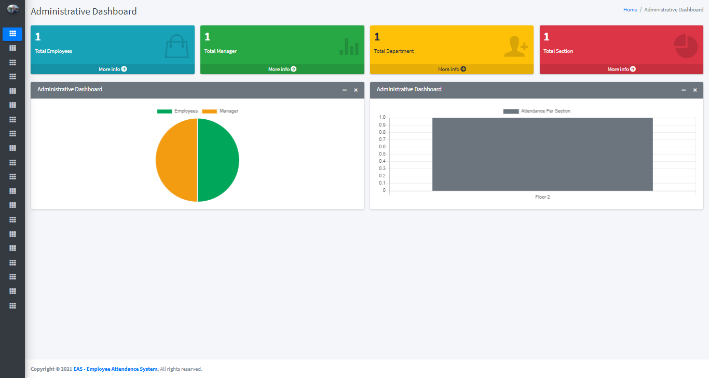
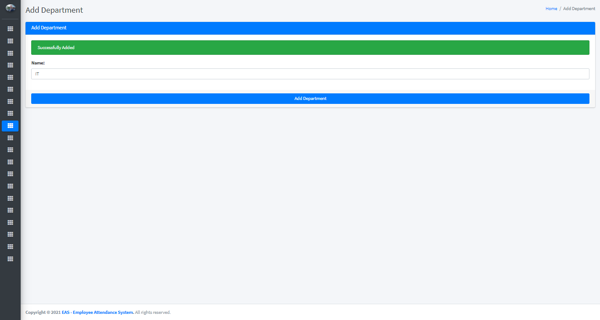
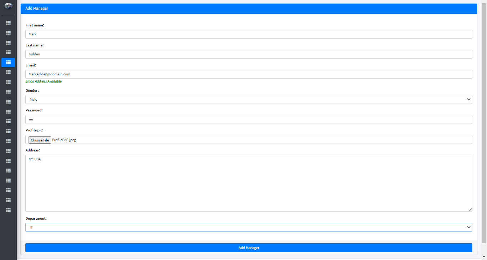
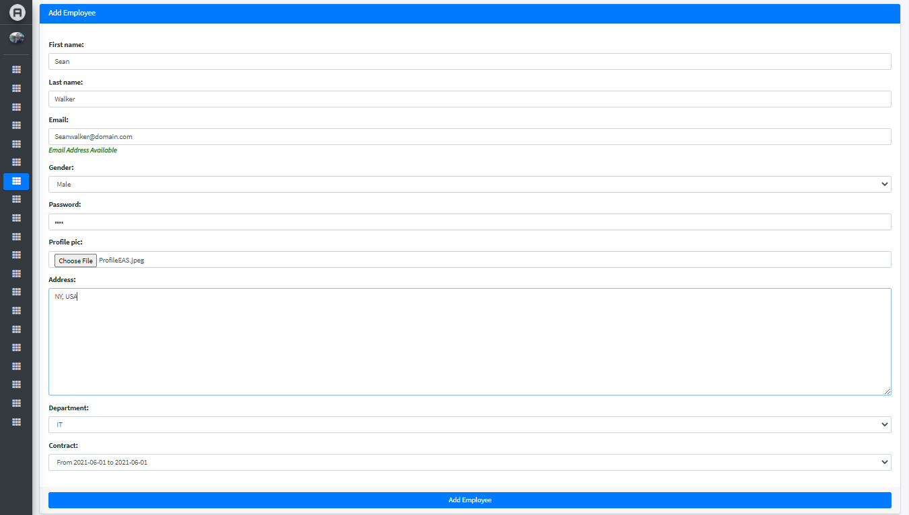
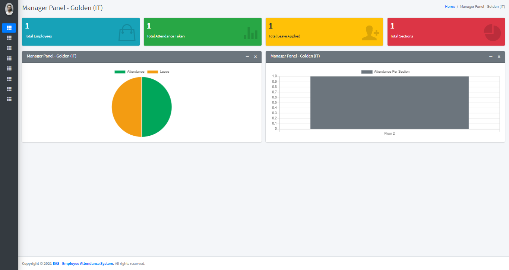
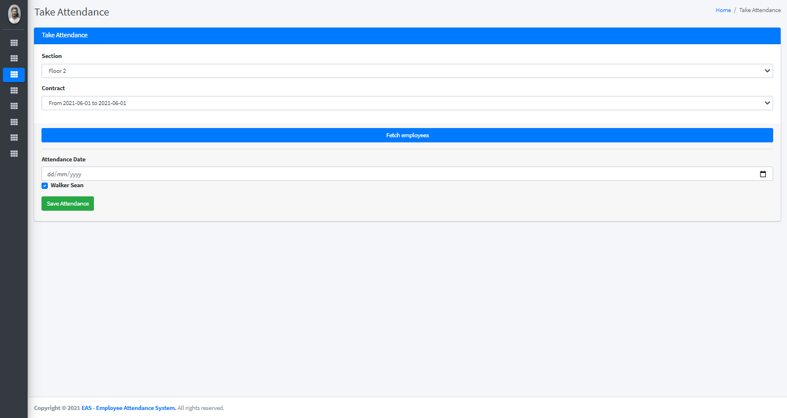
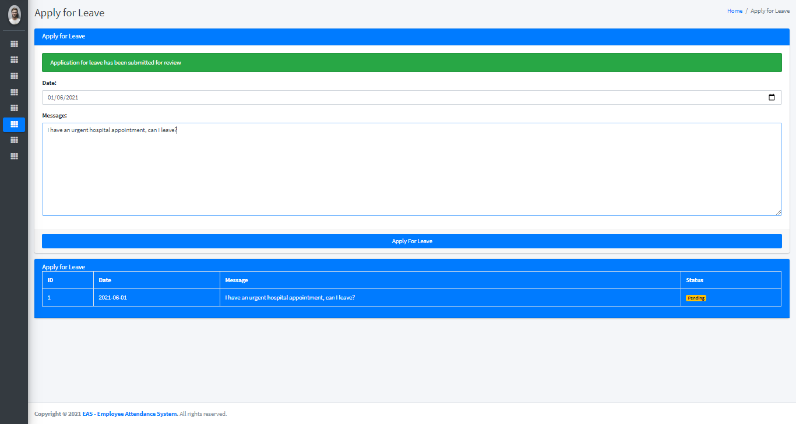
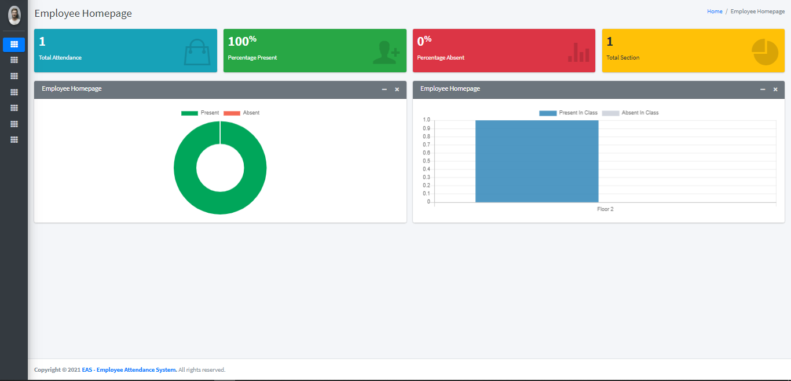
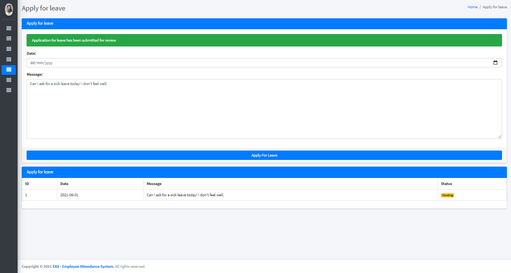

# Employee Attendance System (EAS)
Employee Attendance System (EAS) | Including admin side UI (FULL ACCESS), Manager side UI and Employee side UI, with user authentication login/ registration for better security. Using HTML, CSS, JavaScript, Python and Django as a framework.

## ❔ What is EAS?
A way of managing employees' attendance to reduce the loss due to employee absence. A positive attendance system strategy depends on incentives, effective employee engagement, and transparent communication. The attendance system specifies when employees must attend to work, especially with hourly or nonexempt employees. This system is crucial for nonexempt employees, who perform jobs that require a person to be there to serve customers. However, without the attendance system, recording this information was a full of mistakes. The usual attendance method was to record the data on Excel sheets or physical attendance registers (Paper). These old methods lead to plenty of human errors.

## ⚙️ HOW THE SYSTEM WORKS?

### Admin Side Interface:
#### 1. Admin Dashboard
This dashboard specifies the total No. of Managers, Employees, Departments and Sections as well as the attendance of both Managers and Employees in different departments and sections.


#### 2. Add Manager
To add a manager there are two steps:
* **1st**: Add a new department, where the manager will be leading.


* **2nd**: Add the manager of the department.


#### 3. Add Employee
To add an employee there are two steps:
* **1st**: Add a contract, where the employees will be grouped into different contracts.


* **2nd**: Add an employee using the department where the employee will be working under the manager of the department as well as the contract.


### Manager Side Interface:
#### 1. Manager Dashboard
This dashboard specifies the total No. of Employees in the department, total attendance taken, total leave taken and the total sections related to the department as well as the attendance of Employees in the department and sections.


#### 2. Take Attendance
To take the attendance, you must fill the section of the department where the employee attends and the contract as well as the date of the attendance taking.


#### 3. ask for a leave
The manager can send the admin a request for a leave.

The admin will receive the request and respond to it with (reject or accept).

### Employee Side Interface:
#### 1. Employee Dashboard
This dashboard specifies the total attendance, percentage of attendance, percentage of absence, Total sections the employee may be working at.


#### 2. ask for a leave
The employee can send the admin a request for a leave.

The admin will receive the request and respond to it with (reject or accept).

## 🔑 PEREQUISITES
All the dependencies and required libraries are included in the file requirements.txt [See here](https://github.com/YazanNajem/Employee-Attendance-System-EAS-/blob/master/requirements.txt)

## 🚀 INSTALLATION
#### 1. Clone the repo
``` $ git clone https://github.com/YazanNajem/Employee-Attendance-System-EAS-.git ```

#### 2. Now, run the following command in your Terminal/Command Prompt to install the libraries required.
``` $ pip3 install -r requirements.txt ```

## 👏 ALL done!
Feel free to [mail me](mailto:yazannajem@icloud.com)

## ❤️ Owner
Made with ❤️ by Yazan Najem
